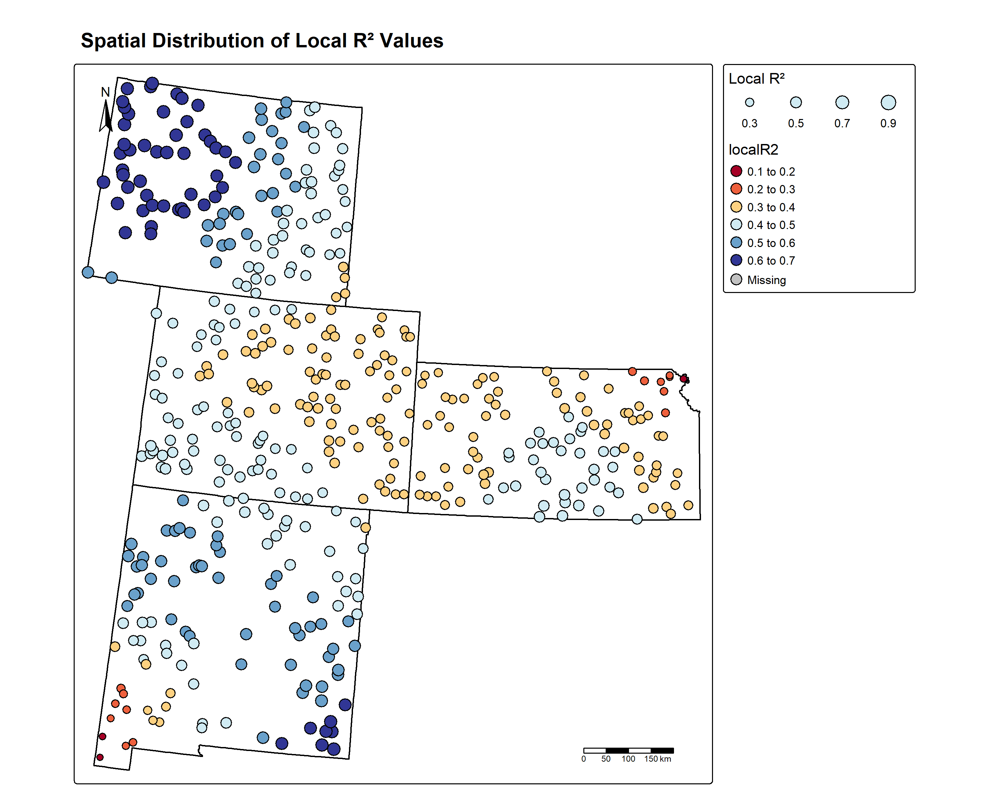
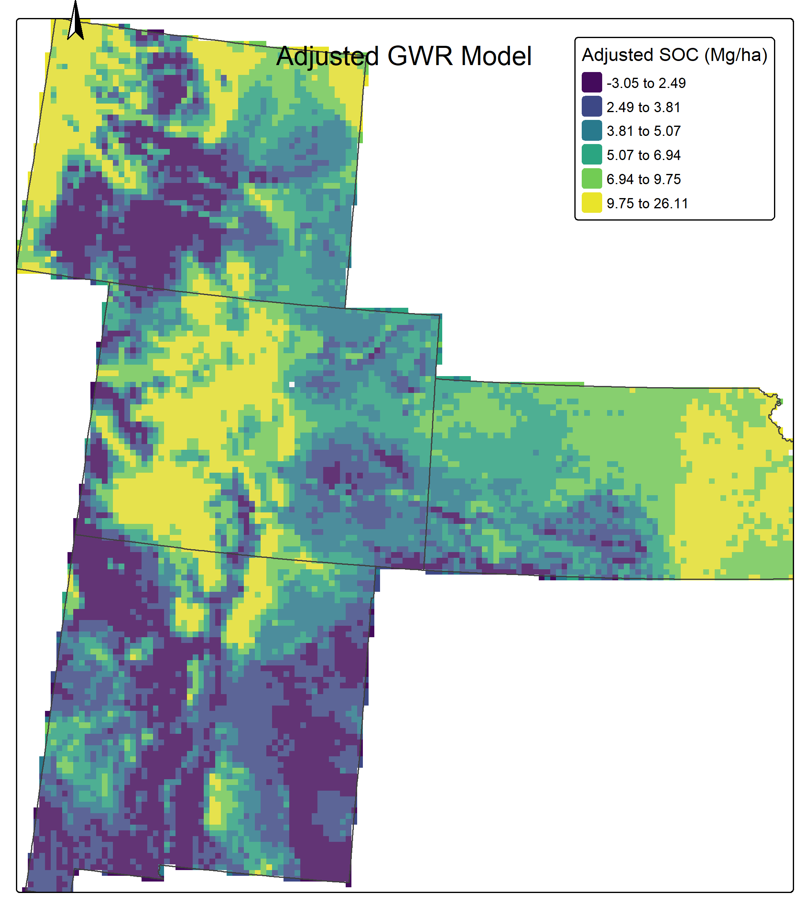

# GWR Modeling Shiny Application

<p align="center">
  
  
</p>

This Shiny application provides a user-friendly interface for Geographically Weighted Regression (GWR) modeling, allowing you to predict soil properties or other spatial variables using environmental predictors.

## Features

- **Data Input**:
  - Upload soil data in CSV format with coordinates and response variable
  - Upload boundary polygon in GeoJSON or GPKG format
  - Upload predictor rasters in TIF format

- **Model Configuration**:
  - Multiple bandwidth selection methods (AIC, CV, AICc)
  - Different kernel types (Gaussian, Exponential, Bisquare)
  - Adaptive bandwidth option
  - Residual kriging for improved predictions

- **Visualization**:
  - Interactive data preview with map
  - Model summary and performance metrics
  - Coefficient maps for each predictor
  - Prediction maps (original and kriging-adjusted)

- **Export Options**:
  - Download metrics as CSV
  - Download plots as PNG
  - Download prediction rasters as GeoTIFF (available in the Download tab)

## Requirements

The application requires R with the following packages:

- shiny, shinydashboard, shinyjs, shinycssloaders, shinythemes
- spgwr, GWmodel
- terra, sf, gstat
- tmap, leaflet
- ggplot2, plotly
- Metrics, automap
- dplyr, ggspatial
- DT

## Running the Application

### Method 1: Using Docker (Recommended)

A pre-built Docker image is available on Docker Hub. You do not need to install R or any packages manually.

1. Pull the image:

   ```sh
   docker pull dockercarlos1626/gwr-shiny-app:latest
   ```

2. Run the app:

   ```sh
   docker run -p 3838:3838 dockercarlos1626/gwr-shiny-app:latest
   ```

3. Open your browser and go to [http://localhost:3838](http://localhost:3838)

### Method 2: Using R Console

```r
# Install required packages if needed
# install.packages(c("shiny", "shinydashboard", "spgwr", "GWmodel", "terra", "sf", "gstat", "tmap", "Metrics", "ggplot2", "automap", "dplyr", "ggspatial", "DT", "leaflet", "shinyjs", "shinycssloaders", "plotly", "shinythemes"))

# Run the app
shiny::runApp("app.R")
```

## Sample Data Format

### Soil Data CSV

The CSV file should contain:

- `x` and `y` columns for coordinates
- Response variable column (e.g., `SOC`)
- Predictor variable columns

Example:

```csv
x,y,SOC,Elevation,Slope,NDVI
580000,4500000,25.3,450,5.2,0.65
580100,4500100,28.1,460,6.1,0.72
...
```

### Sample data

The sample data is available in the `data` folder. It includes:

- `soil_data_gp.csv`: Soil data with coordinates and properties
- `polygon.gpkg`: Boundary polygon
- Various raster files (Aspect.tif, ELEV.tif, etc.): Environmental predictors

The data was downloaded from [https://github.com/zia207/r-colab/tree/main/Data](https://github.com/zia207/r-colab/tree/main/Data). In specific, we used the data consists of Soil samples with Soil Carbon Data (SOC) information from Colorado, Kansas, New Mexico, and Wyoming. The source of the data is the U.S. Geological Survey (USGS) Geochemical and Mineralogical Survey of Soils of the Conterminous United States (Smith et al., 2013).

### Polygon File

A GeoPackage (`.gpkg`) or GeoJSON (`.geojson`) file containing the boundary polygon for masking predictions.

### Predictor Rasters

Raster files (`.tif`) containing environmental predictor variables. The filenames should match the column names in the soil data CSV.

## Workflow

1. Upload your soil data CSV
2. Upload boundary polygon (optional)
3. Upload predictor rasters
4. Configure model parameters
5. Run the GWR model
6. Explore results in the different tabs
7. Download outputs as needed (GeoTIFF raster downloads are available in the Download tab)


## Example Usage

The application comes with example data in the `data` folder:

- `soil_data_gp.csv`: Soil data with coordinates and properties
- `polygon.gpkg`: Boundary polygon
- Various raster files (`Aspect.tif`, `ELEV.tif`, etc.): Environmental predictors

## Project Structure

The application is organized into the following directory structure:

```plaintext
app_gwr/
├── app.R                  # Main Shiny application code
├── Dockerfile             # Docker configuration for containerized deployment
├── gwr_test.R             # Testing script for the GWR functionality
├── install_packages.R     # Script to install required R packages
├── README.md              # This documentation file
├── data/                  # Sample data files
│   ├── Aspect.tif         # Aspect predictor raster
│   ├── ELEV.tif           # Elevation predictor raster
│   ├── NDVI.tif           # NDVI predictor raster
│   ├── polygon.gpkg       # Boundary polygon for masking
│   ├── Silt_Clay.tif      # Silt-clay ratio predictor raster
│   ├── Slope.tif          # Slope predictor raster
│   ├── soil_data_gp.csv   # Sample soil data with coordinates
│   └── soil_data.gpkg     # Sample soil data in GeoPackage format
├── docs/                  # Documentation and references
│   ├── ds801.pdf          # USGS Data Series 801 document
│   └── smith2011.pdf      # Reference paper from Smith et al. (2011)
├── outputs/               # Generated model outputs
│   ├── coef_*.tif         # Coefficient rasters for each predictor
│   ├── masked_*.tif       # Masked coefficient rasters
│   ├── final_prediction.tif # Final prediction raster (with kriging)
│   ├── prediction_gwr.tif # Raw GWR prediction raster
│   ├── intercept.tif      # Intercept coefficient raster
│   ├── kriging_residuals.tif # Kriged residuals raster
│   ├── gwr_results.csv    # GWR model results
│   └── model_metrics.csv  # Model performance metrics
├── plots/                 # Generated visualization plots
│   ├── adjusted_gwr_prediction_masked.png # Adjusted prediction map
│   ├── automatic_variogram.png           # Fitted variogram plot
│   ├── experimental_variogram_torobamba.png # Experimental variogram
│   ├── r2_tmap_contrast.png              # R² distribution map
│   ├── residuals_histogram.png           # Histogram of residuals
│   └── residuals_plot_sizes.png          # Residuals plot with point sizes
└── www/                   # Web assets for the Shiny application
    ├── gwr_logo.svg       # GWR application logo
    └── logo_educagis.png  # Educational GIS logo
```

### Folders Overview

- **data/**: Contains sample datasets used by the application including soil data, boundary polygons, and predictor rasters.
- **docs/**: Contains reference documents and papers relevant to the data source and methodology.
- **outputs/**: Where the application saves model outputs such as coefficient maps, prediction rasters, and metrics.
- **plots/**: Contains various visualization outputs generated by the application.
- **www/**: Web assets used by the Shiny application interface.

## Usage Notes

- For large datasets or high-resolution rasters, the model may take some time to run
- Ensure your data uses a consistent coordinate reference system (CRS)

---


## Acknowledgments

<p align="center">
  
</p>

This project was developed by Carlos Carbajal at EducaGIS. For more details or inquiries, please contact:

- **Developer:** Carlos Carbajal
- **Email:** ccarbajal@educagis.com
- **Organization:** EducaGIS

## References

1. Smith, D.B., Cannon, W.F., Woodruff, L.G., Solano, Federico, Kilburn, J.E., and Fey, D.L., 2013, Geochemical and mineralogical data for soils of the conterminous United States: U.S. Geological Survey Data Series 801, 19 p., [https://pubs.usgs.gov/ds/801/](https://pubs.usgs.gov/ds/801/).
2. Smith, D. B., Cannon, W. F., & Woodruff, L. G. (2011). A national-scale geochemical and mineralogical survey of soils of the conterminous United States. Applied Geochemistry, 26, S250–S255. [https://doi.org/10.1016/j.apgeochem.2011.03.116](https://doi.org/10.1016/j.apgeochem.2011.03.116)
